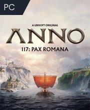

# VIGNETTES DE JEUX

Cette page regroupe les différents types de vignettes (cards) utilisées pour afficher les jeux :
vue catalogue, vue liste, vue compacte, etc.

---

## Vignette Top 25

Taille de base de la vignette = largeur de la carte
 - ratio de l'image (largeur / hauteur)
 - Pour changer le format, il suffit de modifier UNIQUEMENT --card-width.
 - Le ratio reste fixe, la hauteur s'adapte automatiquement.

### Aperçu
<link rel="stylesheet" href="./css/components.css">

<div class="game-card">
  <div class="game-card-image-wrapper">
    
    <div class="game-card-number">1</div>
  </div>
  <div class="game-card-body-top25">
    <div class="game-card-title">Anno 117: Pax Romana</div>
    <div class="game-card-store">Gamivo</div>
  </div>
  <div class="game-card-footer">
    <div class="game-card-discount">-20%</div>
    <div class="game-card-price">38.40€</div>
  </div>
</div>

---

### HTML
```html
<div class="game-card">
  <div class="game-card-image-wrapper">
    
    <div class="game-card-number">1</div>
  </div>
  <div class="game-card-body-top25">
    <div class="game-card-title">Anno 117: Pax Romana</div>
    <div class="game-card-store">Gamivo</div>
  </div>
  <div class="game-card-footer">
    <div class="game-card-discount">-20%</div>
    <div class="game-card-price">38.40€</div>
  </div>
</div>
```

### CSS
```css

.game-card {
  --card-width: 180px;      /* largeur de base de l'image */

  width: 100%;
  max-width: var(--card-width);
  background-color: #202533;
  color: #ffffff;
  border-radius: 5px;
  overflow: hidden;
  font-family: var(--font-main);
  display: flex;
  flex-direction: column;
}

.game-card-row {
  display: flex;
  flex-wrap: wrap;
  gap: 12px;
}

.game-card-image-wrapper {
  position: relative;
  width: 100%;
  aspect-ratio: 180 / 220; /* ratio largeur / hauteur de l'image */
  overflow: hidden;
}

.game-card-image {
  width: 100%;
  height: 100%;
  object-fit: cover;
  display: block;
}

.game-card-number {
  position: absolute;
  top: 0px;
  right: 0px;
  background-color: rgba(0, 0, 0, 0.4);
  color: #ffffff;
  font-size: 18px;
  padding: 6px 12px;
}

.game-card-body-top25 {
  padding: 6px 6px 0 6px;
  height: 90px; /* hauteur fixe pour que la zone sous l'image reste constante */
  box-sizing: border-box;
  overflow: hidden;
  display: flex;
  flex-direction: column;
}

.game-card-title {
  font-size: 15px;
  font-weight: 500;
  line-height: 1.1;
  margin: 0 0 4px;
}

.game-card-store {
  font-size: 15px;
  color: #8397c2;
  margin-top: auto; /* se place en bas du bloc parent */
}

.game-card-footer {
  height: 40px;  
  display: flex;
  justify-content: space-between;
  align-items: center;
  margin-top: 4px;
}

.game-card-discount {
  height: inherit;
  width: 32%;
  display: flex;
  align-items: center;
  justify-content: flex-start;
  padding-left: 6px;
  background-color: #1c9b6c;
  color: #ffffff;
  font-size: 15px;
  font-weight: 500;
  clip-path: polygon(0 0, 100% 0, 80% 100%, 0 100%); /* biseau côté prix */
}

.game-card-price {
  height: inherit;
  width: 52%;
  display: flex;
  align-items: center;
  justify-content: flex-end;
  padding-right: 6px;
  background-color: #0195ff;
  color: #ffffff;
  font-size: 20px;
  font-weight: 500;
  clip-path: polygon(15% 0, 100% 0, 100% 100%, 0 100%); /* biseau côté discount */
}
```

## Vignette Coming Soon

 - Pas de marchands, date de sortie en bas à gauche

### Aperçu
<link rel="stylesheet" href="./css/components.css">

<div class="game-card">
  <div class="game-card-image-wrapper">
    
    <div class="game-card-number">1</div>
  </div>
  <div class="game-card-body-top25">
    <div class="game-card-title">Anno 117: Pax Romana</div>
  </div>
  <div class="game-card-footer">
    <div class="game-card-release-hp">09/05/2025</div>
    <div class="game-card-price">38.40€</div>
  </div>
</div>

---

### HTML
```html
<div class="game-card">
  <div class="game-card-image-wrapper">
    
    <div class="game-card-number">1</div>
  </div>
  <div class="game-card-body-top25">
    <div class="game-card-title">Anno 117: Pax Romana</div>
  </div>
  <div class="game-card-footer">
    <div class="game-card-release-hp">09/05/2025</div>
    <div class="game-card-price">38.40€</div>
  </div>
</div>
```

### CSS
```css

.game-card {
  --card-width: 180px;      /* largeur de base de l'image */

  width: 100%;
  max-width: var(--card-width);
  background-color: #202533;
  color: #ffffff;
  border-radius: 5px;
  overflow: hidden;
  font-family: var(--font-main);
  display: flex;
  flex-direction: column;
}

.game-card-row {
  display: flex;
  flex-wrap: wrap;
  gap: 12px;
}

.game-card-image-wrapper {
  position: relative;
  width: 100%;
  aspect-ratio: 180 / 220; /* ratio largeur / hauteur de l'image */
  overflow: hidden;
}

.game-card-image {
  width: 100%;
  height: 100%;
  object-fit: cover;
  display: block;
}

.game-card-number {
  position: absolute;
  top: 0px;
  right: 0px;
  background-color: rgba(0, 0, 0, 0.4);
  color: #ffffff;
  font-size: 18px;
  padding: 6px 12px;
}

.game-card-body-top25 {
  padding: 6px 6px 0 6px;
  height: 90px; /* hauteur fixe pour que la zone sous l'image reste constante */
  box-sizing: border-box;
  overflow: hidden;
  display: flex;
  flex-direction: column;
}

.game-card-title {
  font-size: 15px;
  font-weight: 500;
  line-height: 1.1;
  margin: 0 0 4px;
}

.game-card-footer {
  height: 40px;  
  display: flex;
  justify-content: space-between;
  align-items: center;
  margin-top: 4px;
}

.game-card-price {
  height: inherit;
  width: 52%;
  display: flex;
  align-items: center;
  justify-content: flex-end;
  padding-right: 6px;
  background-color: #0195ff;
  color: #ffffff;
  font-size: 20px;
  font-weight: 500;
  clip-path: polygon(15% 0, 100% 0, 100% 100%, 0 100%); /* biseau côté discount */
}

.game-card-release-hp {
  font-size: 13px;
  color: #8397c2;
  margin-left: 6px;
}
```

## Vignette Catalogue :

A rajouter le historical low, le marchand comme dans le catalogue actuel et les plateformes !!

Différences notables
 - Hauteur sous l'image doublé (90px à 185px)
 - Historical Low
 - Marchand centré
 - Plus de notation dans le coin supèrieur droit
 - Date de sortie sous le titre du jeu
 - Plates formes disponibles (détail en hover)

### Aperçu
<link rel="stylesheet" href="./css/components.css">

<div class="game-card">
  <div class="game-card-image-wrapper">
    
  </div>
  <div class="game-card-body-catalogue">
    <div class="game-card-title">Anno 117: Pax Romana</div>
    <div class="game-card-release">9 Janvier 2025</div>
    <div class="game-card-store">Gamivo</div>
  </div>
  <div class="game-card-footer">
    <div class="game-card-discount">-20%</div>
    <div class="game-card-price">38.40€</div>
  </div>
</div>

### HTML
```html
<div class="game-card">
  <div class="game-card-image-wrapper">
    
  </div>
  <div class="game-card-body-catalogue">
    <div class="game-card-title">Anno 117: Pax Romana</div>
    <div class="game-card-release">9 Janvier 2025</div>
    <div class="game-card-store">Gamivo</div>
  </div>
  <div class="game-card-footer">
    <div class="game-card-discount">-20%</div>
    <div class="game-card-price">38.40€</div>
  </div>
</div>
```

### CSS
```css

.game-card {
  --card-width: 180px;      /* largeur de base de la carte */

  width: 100%;
  max-width: var(--card-width);
  background-color: #202533;
  color: #ffffff;
  border-radius: 5px;
  overflow: hidden;
  font-family: var(--font-main);
  display: flex;
  flex-direction: column;
}

.game-card-row {
  display: flex;
  flex-wrap: wrap;
  gap: 12px;
}

.game-card-image-wrapper {
  position: relative;
  width: 100%;
  aspect-ratio: 180 / 220; /* ratio largeur / hauteur de l'image */
  overflow: hidden;
}

.game-card-image {
  width: 100%;
  height: 100%;
  object-fit: cover;
  display: block;
}

.game-card-body-catalogue {
  padding: 6px 6px 0 6px;
  height: 185px; /* hauteur fixe pour que la zone sous l'image reste constante */
  box-sizing: border-box;
  overflow: hidden;
  display: flex;
  flex-direction: column;
}

.game-card-title {
  font-size: 15px;
  font-weight: 500;
  line-height: 1.1;
  margin: 0 0 4px;
}

.game-card-store {
  font-size: 15px;
  color: #8397c2;
  margin-top: auto; /* se place en bas du bloc parent */
}

.game-card-footer {
  height: 40px;  
  display: flex;
  justify-content: space-between;
  align-items: center;
  margin-top: 4px;
}

.game-card-discount {
  height: inherit;
  width: 32%;
  display: flex;
  align-items: center;
  justify-content: flex-start;
  padding-left: 6px;
  background-color: #1c9b6c;
  color: #ffffff;
  font-size: 15px;
  font-weight: 500;
  clip-path: polygon(0 0, 100% 0, 80% 100%, 0 100%); /* biseau côté prix */
}

.game-card-price {
  height: inherit;
  width: 52%;
  display: flex;
  align-items: center;
  justify-content: flex-end;
  padding-right: 6px;
  background-color: #0195ff;
  color: #ffffff;
  font-size: 20px;
  font-weight: 500;
  clip-path: polygon(15% 0, 100% 0, 100% 100%, 0 100%); /* biseau côté discount */
}
```

## Liste Catalogue :

A changer les plateformes, ajouter le historical low en version desktop.

### Aperçu
<link rel="stylesheet" href="components.css" />

  <div class="game-card-list">
    <div class="game-card-list-header">
      <span class="game-card-title">Call of Duty modern warfare 2</span>
      <div class="game-card-platforms">
        <span class="game-card-platform-icon game-card-platform--pc">PC</span>
        <span class="game-card-platform-icon game-card-platform--ps">PS</span>
        <span class="game-card-platform-icon game-card-platform--xbox">X</span>
      </div>
    </div>
    <div class="game-card-list-main">
      <div class="game-card-list-cover">
        
      </div>
      <div class="game-card-list-body">
        <div class="game-card-body-header-desktop">
          <span class="game-card-title">Call of Duty modern warfare 2</span>
          <div class="game-card-platforms">
            <span class="game-card-platform-icon game-card-platform--pc">PC</span>
            <span class="game-card-platform-icon game-card-platform--ps">PS</span>
            <span class="game-card-platform-icon game-card-platform--xbox">X</span>
          </div>
        </div>
        <div class="game-card-store">Gamivo</div>
        <div class="game-card-release">30 Oct, 2025</div>
      </div>
      <div class="game-card-list-price">
        <span class="game-card-price-value">38.40€</span>
      </div>
    </div>
  </div>

### HTML
```html
<link rel="stylesheet" href="components.css" />

<div class="game-card-list">
  <div class="game-card-list-header">
    <span class="game-card-title">Call of Duty modern warfare 2</span>
    <div class="game-card-platforms">
      <span class="game-card-platform-icon game-card-platform--pc">PC</span>
      <span class="game-card-platform-icon game-card-platform--ps">PS</span>
      <span class="game-card-platform-icon game-card-platform--xbox">X</span>
    </div>
  </div>
  <div class="game-card-list-main">
    <div class="game-card-list-cover">
      
    </div>
    <div class="game-card-list-body">
      <div class="game-card-body-header-desktop">
        <span class="game-card-title">Call of Duty modern warfare 2</span>
        <div class="game-card-platforms">
          <span class="game-card-platform-icon game-card-platform--pc">PC</span>
          <span class="game-card-platform-icon game-card-platform--ps">PS</span>
          <span class="game-card-platform-icon game-card-platform--xbox">X</span>
        </div>
      </div>
      <div class="game-card-store">Gamivo</div>
      <div class="game-card-release">30 Oct, 2025</div>
    </div>
     <div class="game-card-list-price">
       <span class="game-card-price-value">38.40€</span>
     </div>
  </div>
</div>
```

### CSS
```css
.game-card-list {
  color: var(--text-main);
  max-width: 100%;
  margin: 4px;
  position: relative;
}

.game-card-list-header {
  display: flex;
  align-items: baseline;
  gap: 4px;
  margin-bottom: 4px;
  flex-wrap: wrap;          /* permet au titre et aux badges de revenir à la ligne en mobile */
}

.game-card-list-main {
  display: flex;
  align-items: center;
  background: var(--bg-card);
  border-radius: 4px;
  position: relative;        /* permet de positionner le prix par rapport au container */
  padding-right: 96px;       /* réserve l'espace pour le bloc prix à droite */
  overflow: hidden;          /* l'image et le bloc prix héritent visuellement du border-radius */
}

.game-card-list-cover {
  flex: 0 0 auto;
  position: relative;
  overflow: hidden;
}

.game-card-list-cover img {
  width: 100%;
  height: auto;
  display: block;
}

.game-card-list-body {
  flex: 1 1 auto;
  padding-left: 8px;
  display: flex;
  flex-direction: column;
  justify-content: space-between; /* premier enfant en haut, dernier en bas */
  min-height: 60px;               /* crée un vrai espace vertical entre marchand et date */
}

.game-card-body-header-desktop {
  display: none; /* visible seulement en desktop */
}

.game-card-title {
  font-size: 15px;
  font-weight: 500;
}

.game-card-release {
  font-size: 13px;
  color: var(--text-muted);
}

.game-card-platform-icon {
  width: 18px;
  height: 18px;
  border-radius: 3px;
  display: inline-flex;
  align-items: center;
  justify-content: center;
  font-size: 10px;
  font-weight: 500;
  color: #fff;
}

.game-card-platform--pc {
  background: #4b8df8;
}

.game-card-platform--ps {
  background: #3d5af1;
}

.game-card-platform--xbox {
  background: #2da84b;
}

.game-card-store {
  font-size: 13px;
  color: var(--text-muted);
}

.game-card-list-price {
  position: absolute;
  right: 0;
  bottom: 0;                 /* collé en bas à droite du container */
  min-width: 85px;
  background: var(--price-bg);
  color: #fff;
  display: flex;
  align-items: center;
  justify-content: center;
  font-size: 15px;
  font-weight: 500;
  padding: 4px 0 4px 12px;
  clip-path: polygon(18% 0, 100% 0, 100% 100%, 0 100%);
}

.game-card-price-value {
  margin-left: 4px;
}

@media (min-width: 768px) {
  .game-card-list-header {
    display: none;            /* on cache le header en desktop */
  }

  .game-card-body-header-desktop {
    display: flex;            /* header interne, à la place du marchand */
    align-items: baseline;
    gap: 4px;
    margin-bottom: 4px;
  }

  .game-card-list-main {
    align-items: stretch;     /* le bloc prix peut prendre toute la hauteur en desktop */
  }

  .game-card-list-price {
    top: 0;
    bottom: auto;
    height: 100%;
    min-height: 100%;
    padding: 0 16px;
    clip-path: none;          /* plus de polygon en desktop */
    display: flex;
    flex-direction: row;
    align-items: center;      /* centre verticalement le prix */
    justify-content: center;  /* centre horizontalement le prix dans le bloc bleu */
    column-gap: 8px;
  }

  /* Desktop : marchand à gauche du bloc prix, pas dedans */
  .game-card-store {
    position: absolute;       /* marchand à gauche du bloc prix, pas dedans */
    right: 135px;             /* légèrement à gauche de la zone réservée au prix (96px + marge) */
    top: 50%;
    transform: translateY(-50%);
    white-space: nowrap;
  }

  .game-card-list-body {
    padding: 5px 8px;
  }
}
```

## Liste Gift Cards :

game-card-flag--fr : utiliser --{code pays ISO} (ex. --us, --de, --uk) selon la gift card.

### Aperçu
<link rel="stylesheet" href="components.css" />

<div class="game-card-list">
  <div class="game-card-list-header">
      span class="game-card-title">Playstation Gift Card France - EUR</span>
    <span class="game-card-flag game-card-flag--fr"></span>
  </div>
  <div class="game-card-list-main">
    <div class="game-card-list-cover">
      
    </div>
  <div class="game-card-list-body">
      <div class="game-card-body-header-desktop">
        <span class="game-card-title">Playstation Gift Card France - EUR</span>
        <span class="game-card-flag game-card-flag--fr"></span>
      </div>
      <div class="game-card-store">Gamivo</div>
      <div class="game-card-value">Gift card: 50 EUR</div>
    </div>
  <div class="game-card-list-price">
      <span class="game-card-price-value">38.40€</span>
    </div>
  </div>
</div>

### HTML
```html
<link rel="stylesheet" href="components.css" />

<div class="game-card-list">
  <div class="game-card-list-header">
      span class="game-card-title">Playstation Gift Card France - EUR</span>
    <span class="game-card-flag game-card-flag--fr"></span>
  </div>
  <div class="game-card-list-main">
    <div class="game-card-list-cover">
      
    </div>
  <div class="game-card-list-body">
      <div class="game-card-body-header-desktop">
        <span class="game-card-title">Playstation Gift Card France - EUR</span>
        <span class="game-card-flag game-card-flag--fr"></span>
      </div>
      <div class="game-card-store">Gamivo</div>
      <div class="game-card-value">Gift card: 50 EUR</div>
    </div>
  <div class="game-card-list-price">
      <span class="game-card-price-value">38.40€</span>
    </div>
  </div>
</div>
```

### CSS
```css
.game-card-list {
  color: var(--text-main);
  max-width: 100%;
  margin: 4px;
  position: relative;
}

.game-card-list-header {
  display: flex;
  align-items: baseline;
  gap: 4px;
  margin-bottom: 4px;
  flex-wrap: wrap;          /* permet au titre et aux badges de revenir à la ligne en mobile */
}

.game-card-list-main {
  display: flex;
  align-items: center;
  background: var(--bg-card);
  border-radius: 4px;
  position: relative;        /* permet de positionner le prix par rapport au container */
  padding-right: 96px;       /* réserve l'espace pour le bloc prix à droite */
  overflow: hidden;          /* l'image et le bloc prix héritent visuellement du border-radius */
}

.game-card-list-cover {
  flex: 0 0 auto;
  position: relative;
  overflow: hidden;
}

.game-card-list-cover img {
  width: 100%;
  height: auto;
  display: block;
}

.game-card-list-body {
  flex: 1 1 auto;
  padding-left: 8px;
  display: flex;
  flex-direction: column;
  justify-content: space-between; /* premier enfant en haut, dernier en bas */
  min-height: 60px;               /* crée un vrai espace vertical entre marchand et date */
}

.game-card-body-header-desktop {
  display: none; /* visible seulement en desktop */
}

.game-card-title {
  font-size: 15px;
  font-weight: 500;
}

.game-card-release,
.game-card-value {
  font-size: 13px;
  color: var(--text-muted);
}

.game-card-platform-icon {
  width: 18px;
  height: 18px;
  border-radius: 3px;
  display: inline-flex;
  align-items: center;
  justify-content: center;
  font-size: 10px;
  font-weight: 500;
  color: #fff;
}

.game-card-platform--pc {
  background: #4b8df8;
}

.game-card-platform--ps {
  background: #3d5af8;
}

.game-card-platform--xbox {
  background: #2da84b;
}

.game-card-store {
  font-size: 13px;
  color: var(--text-muted);
}

.game-card-flag {
  width: 18px;
  height: 12px;
  border-radius: 2px;
  flex-shrink: 0;
  box-shadow: 0 0 0 1px rgba(0, 0, 0, 0.4);
}

.game-card-flag--fr {
  background: linear-gradient(to right,
    #0055a4 0%, #0055a4 33%,
    #ffffff 33%, #ffffff 66%,
    #ef4135 66%, #ef4135 100%);
}

.game-card-list-price {
  position: absolute;
  right: 0;
  bottom: 0;                 /* collé en bas à droite du container */
  min-width: 85px;
  background: var(--price-bg);
  color: #fff;
  display: flex;
  align-items: center;
  justify-content: center;
  font-size: 15px;
  font-weight: 500;
  padding: 4px 0 4px 12px;
  clip-path: polygon(18% 0, 100% 0, 100% 100%, 0 100%);
}

.game-card-price-value {
  margin-left: 4px;
}

@media (min-width: 768px) {
  .game-card-list-header {
    display: none;            /* on cache le header en desktop */
  }

  .game-card-body-header-desktop {
    display: flex;            /* header interne, à la place du marchand */
    align-items: baseline;
    gap: 4px;
    margin-bottom: 4px;
  }

  .game-card-list-main {
    align-items: stretch;     /* le bloc prix peut prendre toute la hauteur en desktop */
  }

  .game-card-list-price {
    top: 0;
    bottom: auto;
    height: 100%;
    min-height: 100%;
    padding: 0 16px;
    clip-path: none;          /* plus de polygon en desktop */
    display: flex;
    flex-direction: row;
    align-items: center;      /* centre verticalement le prix */
    justify-content: center;  /* centre horizontalement le prix dans le bloc bleu */
    column-gap: 8px;
  }

  /* Desktop : marchand à gauche du bloc prix, pas dedans */
  .game-card-store {
    position: absolute;       /* marchand à gauche du bloc prix, pas dedans */
    right: 135px;             /* légèrement à gauche de la zone réservée au prix (96px + marge) */
    top: 50%;
    transform: translateY(-50%);
    white-space: nowrap;
  }

  .game-card-list-body {
    padding: 5px 8px;
  }
}
```